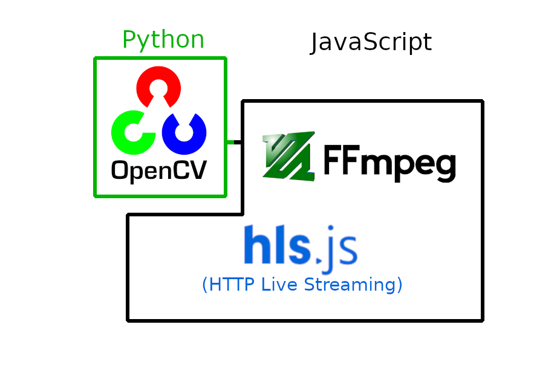

# OpenCV FFmpeg HLS Video Management System

Video management system that uses openCV, FFmpeg, and HLS. Written in Node, Javascript and Python
## Combines OpenCV, FFmpeg and HLS using Javascript and Python

1. Streams RTSP video from cameras using FFmpeg
1. Sends images from stream to OpenCV to do pedestrian detection
1. Superimposed detection areas in stream HLS stream
1. Saves HLS streams for historical playback


## Live Stream
System accepts RTSP streams from an IP cameras as input for FFMPEG. FFMPEG outputs a HLS manifest file for each stream and saves transport files in chronological folder structure.

On the browser, HLS.js downloads the manifest files, retrieves the transport files and streams the live video.

## Historical Playback
FFMPEG stores transport files (.ts) in chronological folder structure. Files older than a configured time are automatically deleted from the manifest file and folder structure. The browser displays all old footage available and can request old transport files to display past footage.

## Pedestrian Detection
While FFMPEG is live streaming, images are extracted from the stream to perform pedestrian detection using OpenCV. The rate that images are extracted can be configured. Usually it is something like 2 frames per second. The result of the image processing is saved as a mostly transparent PNG with boxes containing the regions of interest. The PNG is superimposed on the output stream that is saved in the transport file. One advantage of this approach is live streams can run at its normal 30 frames per second while the superimposed image processing only has to update 2 frames per second.

Pedestrian detection only occurs in parts of the video where motion is detected. This saves CPU processing. See [https://github.com/erceth/motion-pedestrian-detection](https://github.com/erceth/motion-pedestrian-detection).

## Video Explanation
[https://youtu.be/ei9Bki-CbU4](https://youtu.be/ei9Bki-CbU4).


## Dependencies
> Other version may be compatible. These are the versions I used.

ffmpeg v4.2.2,
node v12.16.2,
openCV v4.3.0

*see other documentation for installing these dependencies*

Noteworthy Node Modules:
@erceth/motion-pedestrian-detection


## Getting Started

```
npm install
```

Copy config-server.js.template to config-server.js and config-app.js.template to config-app.js

Explanation:
config-server.js
```
module.exports = {
  general: {
    segmentTime: 4, // length of transport files. Could be set to 60 for minute long historical playback list
    listSize: 1440, // number of transport files saved before oldest gets deleted. Multiple by segmentTime to get age.
    pythonPath: "/Users/ericethington/.pyenv/versions/cv-3.6.10/bin/python3", // Path to python executable with openCV installed
    imshow: 0, // Displays the detection results in using openCV's imshow function. Useful for debugging. Turn off in production and command line only environments. 1 is on, 0 is off.
    writeOutput: 0, // Writes the detection results to file. One source of output that can be consumed by greater application that wraps around this project. 1 is on, 0 is off.
    writeTransparentOutput: 1 // A mostly transparent PNG with boxes containing the regions of interest. The PNG can be superimposed on the output stream. 1 is on, 0 is off.
  },
  cameras: [
    {
      // input: 'ped3-480.mp4', // causes FFMPEG to stream from a local video file. Good for debugging
      ip: '192.168.1.88', // ip address of ip camera
      path: '/axis-media/media.amp?resolution=640x480', 
      detectParameters: {
        inputFps: 15, // frames per second input stream is converted to
        detectFps: 5, // frames per second detection algorithm is run (careful setting this too high)
        width: 640, // The width of the resolution of the RTSP stream. If outputs looks garbled, this setting might be wrong.
        height: 480, // The height of the resolution of the RTSP stream. If outputs looks garbled, this setting might be wrong.
        minPixelSize: 5000, // The minimum pixel size an object needs to be in order to detect motion. All objects smaller than this will be ignored. May need to adjust as height and width change.
        motionDeltaThreshold: 5, // The sensitivity of motion detection. Lower number results in more motion detection.
        motionPaddingCutoutPercent: .2, // Controls the size of the buffer area around the motion area that is scanned for a pedestrian. Is set as a percentage (e.g. .2 is 20%).
        cutOutHeightLimit: 150, // Limit on how short the padding area can be.
        checkNLargestObjects: 1, // Number of motion areas to perform motion detection on. Setting to 1 will only motion detection on the largest area. Setting to 2 will perform motion detect on the two largest areas, etc.
        windowStride: 4, // How quickly searching window parses an image. Lower number means high CPU intensive and more accurate. Higher number means less CPU intensive but less accurate. Min value of 1.
        hogPadding: 4, // The number of pixels in both the x and y direction in which the sliding window ROI is “padded” prior to HOG feature extraction. Typical values for padding include (8, 8), (16, 16), (24, 24), and (32, 32)
        hogScale: 1.05, // Controls the resize factor while process is repeatedly resizing image to find pedestrians. Smaller results in more resizes, more accurate and more CPU usage. Lower is less resizes, less accurate and less CPU usage. Minimum is 1.01.
        hogHitThreshold: 0, // hog variable in determining overlapping detection. Unless you know what you are doing, set to 0 and use overlapThresh
        nonMaxSuppressionThreshold: .65 // Used for non-maximum suppression, corrects for multiple detection of the same pedestrian. Amount of overlap per detection before counting it as a single detection.
      }
    },
    { // a second video stream with same parameters as above
      ip: 'wowzaec2demo.streamlock.net',
      path: '/vod/mp4:BigBuckBunny_115k.mov',
      detectParameters: {
        inputFps: 3,
        detectFps: 2,
        width: 240,
        height: 160,
        minPixelSize: 5000,
        motionDeltaThreshold: 5,
        motionPaddingCutoutPercent: .2,
        cutOutHeightLimit: 150,
        checkNLargestObjects: 1,
        windowStride: 4,
        hogPadding: 4,
        hogScale: 1.05,
        hogHitThreshold: 0,
        nonMaxSuppressionThreshold: .65
      }
    }
  ]
}
// number of streams MUST MATCH config-app.js
```

config-app.js
Tells front-end how many streams to expect. Must match config-server.js
```
const config = {
  cameras: [
    {
      index: 0
    },
    {
      index: 1
    }
  ]
};
```

### Run
```
node index.js
```

Open: http://localhost:3000


### Created files
There are a few files and folders that are created after the program is run at least once.

* camera0, camera1,... cameraN - These are folders created to hold the transport files for each camera stream. These files are what HLS uses to stream to the browser.
* output-detect0.png, output-detect1.png,... output-detect1.png - Image showing the latest detection area. These are superimposed on to the camera stream and saved as a transport file. Theses images are saved frequently.
* camera0.m3u8, camera1.m3u8,... cameraN.m3u8 - These are HLS manifest files that HLS uses to keep track of the transport files.
* output0.png, output1.png,... outputN.png - These images appear if the writeOutput configuration is enabled. Can be useful for debugging.